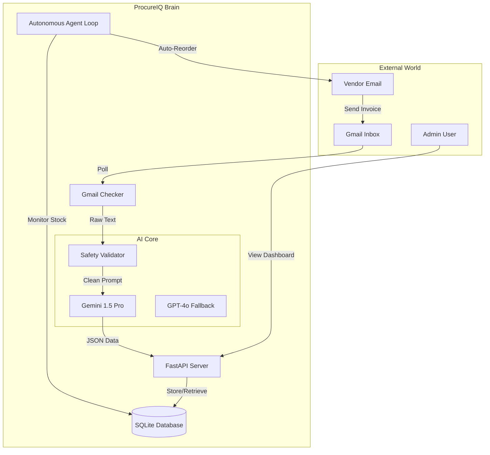

# 🚀 ProcureIQ - AI-Powered Autonomous Procurement System

> Intelligent invoice processing with autonomous vendor matching and real-time inventory management.

[](https://procureiq.onrender.com/)
[](https://www.python.org/)
[](https://fastapi.tiangolo.com/)
[](LICENSE)

## 🌐 Live Deployment

🔗 **Application:** [https://procureiq.onrender.com/](https://procureiq.onrender.com/)  
📚 **API Docs:** [https://procureiq.onrender.com/docs](https://procureiq.onrender.com/docs)  
📊 **System Status:** [https://procureiq.onrender.com/api/system/status](https://procureiq.onrender.com/api/system/status)

---

## ❓ Problem Statement

Small and medium-sized businesses (SMBs) struggle with manual procurement processes:
*   **Invoice Chaos:** Hours spent manually typing invoice data into Excel or ERPs.
*   **Stockouts:** "Forget to order" moments leading to lost revenue.
*   **Vendor Drift:** Losing track of negotiated rates and vendor performance.
*   **Security Risks:** Email-based approval processes are vulnerable to phishing and fraud.

**ProcureIQ** solves this with an **autonomous agent** that lives in your inbox, extracts data with AI, manages inventory, and secures high-value decisions with tokenized approvals.

---

## 🏗️ Architecture



---

## 🤖 Responsible & Secure AI

We prioritize safety and reliability in our AI implementation:

1.  **Prompt Injection Defense**: Every input passes through a dedicated validator that checks for 20+ known injection patterns before reaching the LLM.
2.  **Confidence Scoring**: 
    *   **≥ 95%**: Auto-approved.
    *   **75% - 94%**: Flagged for human review.
    *   **< 75%**: Rejected/Escalated.
3.  **Hallucination Prevention**: We use strict schemas (Pydantic) and multi-model verification (Gemini checked against Rule-Based logic) to ensure data accuracy.
4.  **Privacy First**: Minimal PII retention. AI is used as a *processor*, not a storage engine.

---

## ✨ Features

### 🎯 Core Functionality
- ✅ **Automated Email Monitoring** - Gmail OAuth integration with spam detection
- ✅ **AI Invoice Extraction** - Multi-model support (Gemini, OpenAI, Ollama)
- ✅ **Autonomous Vendor Matching** - Intelligent matching with confidence scoring
- ✅ **Smart Inventory Management** - Real-time stock alerts and auto-reordering
- ✅ **Approval Workflows** - Email/SMS notifications with secure token-based approval
- ✅ **Background Agent** - Autonomous processing with adaptive polling

### 🔒 Security & Safety
- ✅ API Key Authentication on all endpoints
- ✅ Prompt Injection Detection (20+ attack patterns)
- ✅ AI Output Validation with confidence thresholds
- ✅ Environment variable validation on startup
- ✅ Comprehensive error handling framework

---

## 🛠️ Tech Stack

### Backend
- **Framework:** FastAPI 0.115+
- **Language:** Python 3.13
- **Database:** SQLite (SQLAlchemy ORM)
- **API Docs:** Swagger/OpenAPI auto-generated

### AI & Integrations
- **Primary AI:** Google Gemini 1.5 Pro/Flash
- **Fallback AI:** OpenAI GPT-4o
- **Optional:** Ollama (local models)
- **Email:** Gmail API with OAuth2
- **Notifications:** Twilio SMS
- **Monitoring:** Prometheus + Sentry

### DevOps
- **Containerization:** Docker + docker-compose
- **CI/CD:** GitHub Actions
- **Deployment:** Render/Railway ready

---

## 🚀 Quick Start

### Prerequisites
- Python 3.13+
- Google Cloud Console project (for Gemini & Gmail API)
- Optional: OpenAI API key, Twilio account

### Installation

```bash
# Clone repository
git clone https://github.com/ATR1285/Procure.git
cd Procure

# Install dependencies
cd procure_iq_backend
pip install -r requirements.txt

# Configure environment
cp .env.example .env
# Edit .env with your credentials
```

### Run the Server

```bash
# Development
python procure_iq_backend/run.py
```
Server runs on `http://localhost:8888`

---

## 🤝 Team Collaboration

This project follows hackathon best practices:
- 4 team member branches (`Akhil`, `Niranjan-SP`, `Visrutha`, `branch-Richard`)
- Conventional commits (`feat:`, `fix:`, `docs:`, `test:`)
- Comprehensive documentation
- Production-ready code

See [COLLABORATION.md](procure_iq_backend/docs/COLLABORATION.md) for guidelines.

---

## 📄 License

MIT License - See LICENSE file for details
