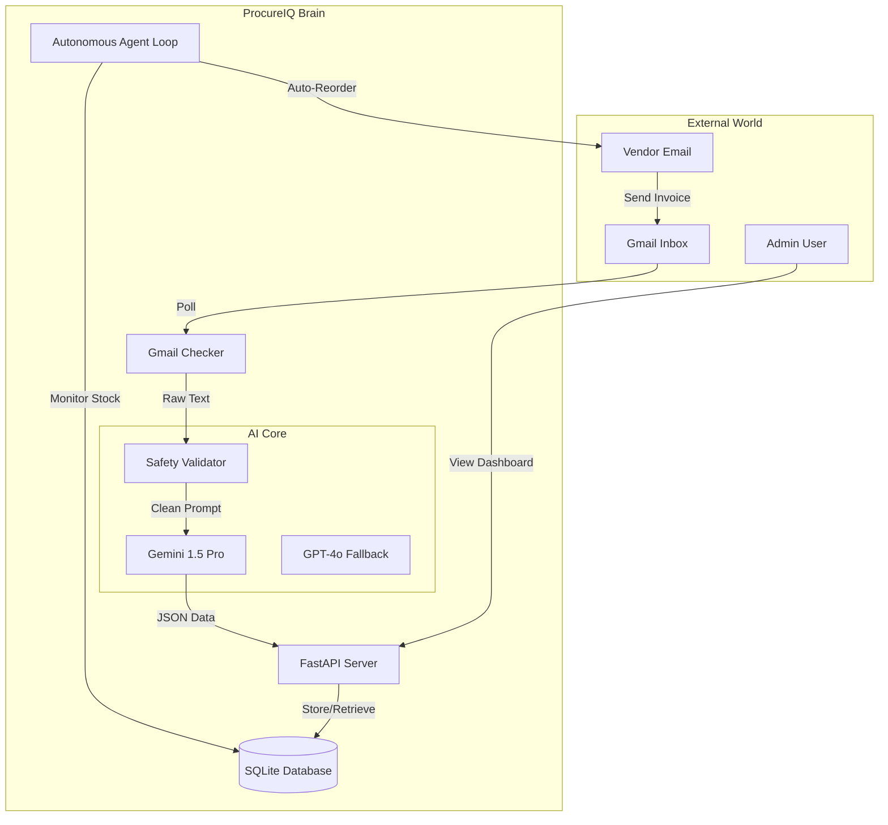

# 🚀 ProcureIQ - AI-Powered Autonomous Procurement System

> Intelligent invoice processing with autonomous vendor matching and real-time inventory management.

[](https://procureiq.onrender.com/)
[](https://www.python.org/)
[](https://fastapi.tiangolo.com/)
[](LICENSE)

## 🌐 Live Deployment

🔗 **Application:** [https://procureiq.onrender.com/](https://procureiq.onrender.com/)  
📚 **API Docs:** [https://procureiq.onrender.com/docs](https://procureiq.onrender.com/docs)  
📊 **System Status:** [https://procureiq.onrender.com/api/system/status](https://procureiq.onrender.com/api/system/status)

---

## ❓ Problem Statement

Small and medium-sized businesses (SMBs) struggle with manual procurement processes:
*   **Invoice Chaos:** Hours spent manually typing invoice data into Excel or ERPs.
*   **Stockouts:** "Forget to order" moments leading to lost revenue.
*   **Vendor Drift:** Losing track of negotiated rates and vendor performance.
*   **Security Risks:** Email-based approval processes are vulnerable to phishing and fraud.

**ProcureIQ** solves this with an **autonomous agent** that lives in your inbox, extracts data with AI, manages inventory, and secures high-value decisions with tokenized approvals.

---

## 🏗️ Architecture



---

## 🤖 Responsible & Secure AI

We prioritize safety and reliability in our AI implementation:

1.  **Prompt Injection Defense**: Every input passes through a dedicated validator that checks for 20+ known injection patterns before reaching the LLM.
2.  **Confidence Scoring**: 
    *   **≥ 95%**: Auto-approved.
    *   **75% - 94%**: Flagged for human review.
    *   **< 75%**: Rejected/Escalated.
3.  **Hallucination Prevention**: We use strict schemas (Pydantic) and multi-model verification (Gemini checked against Rule-Based logic) to ensure data accuracy.
4.  **Privacy First**: Minimal PII retention. AI is used as a *processor*, not a storage engine.

---

## ✨ Features

### 🎯 Core Functionality
- ✅ **Automated Email Monitoring** - Gmail OAuth integration with spam detection
- ✅ **AI Invoice Extraction** - Multi-model support (Gemini, OpenAI, Ollama)
- ✅ **Autonomous Vendor Matching** - Intelligent matching with confidence scoring
- ✅ **Smart Inventory Management** - Real-time stock alerts and auto-reordering
- ✅ **Approval Workflows** - Email/SMS notifications with secure token-based approval
- ✅ **Background Agent** - Autonomous processing with adaptive polling

### 🔒 Security & Safety
- ✅ API Key Authentication on all endpoints
- ✅ Prompt Injection Detection (20+ attack patterns)
- ✅ AI Output Validation with confidence thresholds
- ✅ Environment variable validation on startup
- ✅ Comprehensive error handling framework

---

## 🛠️ Tech Stack

### Backend
- **Framework:** FastAPI 0.115+
- **Language:** Python 3.13
- **Database:** SQLite (SQLAlchemy ORM)
- **API Docs:** Swagger/OpenAPI auto-generated

### AI & Integrations
- **Primary AI:** Google Gemini 2.0 Flash (via OpenRouter)
- **Fallback AI:** Google Gemini 2.5 Flash Preview
- **Email:** Gmail API with OAuth2
- **Notifications:** Twilio SMS
- **Monitoring:** Prometheus + Sentry

### DevOps
- **Containerization:** Docker + docker-compose
- **CI/CD:** GitHub Actions
- **Deployment:** Render/Railway ready

---

## 🚀 Quick Start

### Prerequisites
- Python 3.13+
- Google Cloud Console project (for Gemini & Gmail API)
- Optional: OpenAI API key, Twilio account

### Installation

```bash
# Clone repository
git clone https://github.com/ATR1285/Procure-IQ.git
cd Procure-IQ

# Install dependencies
pip install -r requirements.txt

# Configure environment
cp .env.example .env
# Edit .env with your credentials
```

### Run the Server (with UI)

```bash
python run.py
```
Server runs on `http://localhost:8000`

---

## 🤖 Run Agent Without UI (Standalone Autonomy)

The agent can run **completely independently** of the web UI:

```bash
# Start the autonomous agent (no UI needed)
python agent_runner.py
```

### Prove Autonomy
In a **separate terminal**, insert an event:
```bash
python -c "
import sys; sys.path.insert(0, '.')
from app.database import SessionLocal
from app import models
db = SessionLocal()
e = models.Event(
    event_type='INVOICE_RECEIVED',
    payload={'invoiceNumber': 'INV-TEST-001', 'vendorName': 'Acme Corp', 'invoiceAmount': 1500.00},
    status='PENDING'
)
db.add(e); db.commit()
print(f'Event {e.id} created.')
"
```

Watch the agent logs — the invoice is processed **automatically, no UI interaction**.

---

## 🧠 Observe Learning

Learning is automatic and persists across restarts:

1. **First invoice** from "Acme Corp" → AI matches to "Acme Industries" at ~60% confidence
2. **Human approves** → system auto-learns alias: `"Acme Corp" → "Acme Industries"`
3. **Second invoice** from "Acme Corp" → alias hits instantly → **100% confidence**

Logs to watch:
```
[LEARNING] Learning alias: 'Acme Corp' → 'Acme Industries' (vendor_id=1)
[LEARNING] Alias applied: 'Acme Corp' → vendor_id=1, confidence improved to 100%
```

All alias data is stored in the `vendor_aliases` table and survives restarts.

---

## ⚡ How Real-Time Updates Work

### Single Source of Truth
The SQLite database (WAL mode) is the **only** shared state. Components never cache or mirror data.

### Event Lifecycle
```
PENDING → PROCESSING → DONE/FAILED
```
- **UI/API inserts event** → status = `PENDING`, committed immediately
- **Agent polls** → sees `PENDING`, sets status = `PROCESSING` (lock) 
- **Agent completes** → sets status = `DONE`, commits immediately
- **UI polls** (every 5s) → reads latest DB state, shows updated invoice

### Simultaneous Visibility
| Writer | Reader | How |
|---|---|---|
| UI creates event | Agent sees it | Fresh session per poll cycle |
| Agent updates invoice | UI shows it | UI polls `/api/invoices` every 5s |
| Human approves | Learning persists | Alias stored via `erp_adapter.store_vendor_alias()` |

### Concurrency Safety
- Fresh DB session per operation (no stale reads)
- Event locking prevents double-processing
- WAL mode enables concurrent readers + one writer

---

## 📚 Key Endpoints

### Public
- `GET /` - API landing page
- `GET /docs` - Swagger UI documentation
- `GET /metrics` - Prometheus metrics

### Protected (Requires `X-API-Key` header)
- `GET /api/invoices` - List all invoices
- `POST /api/invoices/simulate` - Simulate invoice processing
- `GET /api/ai-health` - AI services health check
- `GET /api/system/status` - System configuration
- `GET /api/analytics/dashboard` - Analytics data

### Approval Flow (Token-based)
- `GET /api/approve/{token}` - Approve invoice/order
- `GET /api/reject/{token}` - Reject invoice/order

---

## 🏗️ Project Structure

```
Procure-IQ/
├── app/
│   ├── agent/              # AI client, matcher, worker loop
│   │   ├── ai_client.py    # OpenRouter/Gemini AI integration
│   │   ├── matcher.py      # Vendor matching via ERP adapter
│   │   └── worker.py       # Autonomous agent loop
│   ├── api/                # FastAPI routes
│   │   ├── invoices.py     # Invoice CRUD + approval + learning
│   │   ├── simulation.py   # Trigger simulation events
│   │   └── approval_routes.py
│   ├── services/           # ERP adapter, email, SMS
│   │   ├── erp_adapter.py  # ERP abstraction layer
│   │   └── python_erp.py   # Local SQLite ERP client
│   ├── validators/         # AI safety & validation
│   ├── models.py           # SQLAlchemy models (single source)
│   ├── schemas.py          # Pydantic schemas
│   ├── database.py         # DB engine (WAL mode, shared)
│   └── main.py             # FastAPI app + agent thread
├── agent_runner.py         # Standalone agent (no UI)
├── config.py               # Environment configuration
├── gmail_auth_setup.py     # Gmail OAuth setup
├── run.py                  # Server launcher
├── requirements.txt        # Dependencies
├── Dockerfile              # Docker image
└── docker-compose.yml      # Docker services
```

---

## 🧪 Testing

```bash
# Install test dependencies
pip install pytest pytest-asyncio

# Run tests
pytest procure_iq_backend/tests/ -v
```

---

## 🐳 Docker Deployment

```bash
# Build image
docker build -t procureiq:latest procure_iq_backend/

# Run with docker-compose
docker-compose up -d

# View logs
docker-compose logs -f
```

---

## 📊 Monitoring

### Health Checks
```bash
# System status
curl -H "X-API-Key: your_key" http://localhost:8000/api/system/status

# AI health
curl -H "X-API-Key: your_key" http://localhost:8000/api/ai-health

# Metrics
curl http://localhost:8888/metrics
```

### Logging
- Application logs: `procure_iq_backend/app.log`
- Gmail checker logs: `procure_iq_backend/gmail_checker.log`
- Agent loop: stdout/stderr

## 🤝 Team Collaboration

This project follows hackathon best practices:
- 4 team member branches (`Akhil`, `Niranjan-SP`, `Visrutha`, `branch-Richard`)
- Conventional commits (`feat:`, `fix:`, `docs:`, `test:`)
- Comprehensive documentation
- Production-ready code

See [COLLABORATION.md](procure_iq_backend/docs/COLLABORATION.md) for guidelines.

---

## 📄 License

MIT License - See LICENSE file for details
