# ProcureIQ - Autonomous Procurement Intelligence System

[](https://procure-iq.onrender.com)
[](https://github.com/ATR1285/Procure/actions)
[](https://www.python.org/downloads/)
[](LICENSE)

AI-powered procurement automation system with autonomous agent loop, inventory management, and intelligent invoice processing.

> **Live Demo:** [https://procure-iq.onrender.com](https://procure-iq.onrender.com) *(To be deployed)*

## 🎯 Problem Statement

**Challenge:** Modern businesses struggle with manual procurement processes that are:
- ⏰ **Time-consuming**: Manual invoice processing takes hours of human review
- ❌ **Error-prone**: Human mistakes in vendor matching and price verification
- 📊 **Reactive**: Stock-outs discovered too late, disrupting operations
- 💰 **Costly**: Missed early payment discounts and inefficient approval workflows

**Our Solution:** ProcureIQ is an **autonomous AI agent** that:
- 🤖 Continuously monitors email inboxes for invoices and processes them in real-time
- 🎯 Uses advanced LLMs (Gemini 1.5 Pro + GPT-4o fallback) for intelligent vendor matching
- 📈 Proactively monitors inventory levels and triggers replenishment before stock-outs
- ⚡ Automates three-way matching (Invoice ↔ PO ↔ Receipt) with confidence scoring
- 🔔 Sends instant SMS/Email alerts for critical decisions requiring human approval

**Impact:** Reduces procurement cycle time by 80%, eliminates 95% of manual data entry, and prevents stock-outs through predictive alerts.

## 🚀 Features

### Core Capabilities
- **Autonomous Agent Loop**: Background worker that continuously processes procurement events
- **Inventory Management**: Real-time monitoring with automatic alerts and replenishment planning
- **Invoice Processing**: AI-powered vendor matching and three-way verification
- **Smart Notifications**: SMS and email alerts for critical events
- **Odoo ERP Integration**: Seamless connection to Odoo Community Edition via JSON-RPC
- **AI-Powered Matching**: Ollama LLM integration for intelligent vendor name matching
- **Learning System**: Auto-learns vendor name variations on approval

### Technical Features
- **FastAPI Backend**: Modern, high-performance Python API
- **SQLite Database**: Zero-setup local persistence with full audit trail
- **Event-Driven Architecture**: All actions processed as events for reliability
- **Real-time Dashboard**: Live monitoring of system status and agent activity
- **RESTful API**: Complete API with auto-generated documentation

## 🏗️ System Architecture

```mermaid
graph TB
    subgraph "External Inputs"
        A[📧 Gmail Inbox] --> B[Email Service]
        C[📱 SMS Alerts] --> D[Twilio Service]
    end
    
    subgraph "FastAPI Backend"
        B --> E[Invoice Processor]
        E --> F[Event Queue]
        F --> G[Autonomous Agent Loop]
        G --> H{Decision Engine}
        H -->|High Confidence| I[Auto-Approve]
        H -->|Medium| J[Owner Review]
        H -->|Low| K[Escalate]
        
        L[Inventory Monitor] --> F
        M[Stock Alerts] --> D
    end
    
    subgraph "AI Layer"
        N[Gemini 1.5 Pro] --> H
        O[GPT-4o Fallback] --> H
        P[Ollama Local LLM] --> H
    end
    
    subgraph "Data Layer"
        Q[(SQLite DB)]
        E --> Q
        G --> Q
        L --> Q
    end
    
    subgraph "Monitoring"
        R[Prometheus Metrics]
        S[Sentry Error Tracking]
    end
    
    G --> R
    G --> S
```



## 🛠️ Tech Stack

- **Backend**: Python 3.13+ with FastAPI
- **Database**: SQLite with SQLAlchemy ORM
- **AI/LLM**: 
  - **Primary**: Google Gemini 1.5 Pro (via API)
  - **Fallback**: OpenAI GPT-4o
  - **Local Option**: Ollama (llama3.1:8b) for privacy-focused deployments
- **Email**: Gmail API with OAuth2
- **Notifications**: Twilio SMS + Email
- **Monitoring**: Prometheus + Sentry
- **Server**: Uvicorn ASGI server
- **Frontend**: HTML/JavaScript with Tailwind CSS
- **DevOps**: Docker, GitHub Actions CI/CD

## 📋 Prerequisites

- **Python 3.13+** (tested with 3.13.2)
- **Ollama** installed and running (optional - runs in fallback mode without it)
- **Odoo Community Edition** (optional - runs in fallback mode without it)

## 🚀 Quick Start

### 1. Clone the Repository

```bash
git clone https://github.com/ATR1285/Procure.git
cd Procure
```

### 2. Install Python Dependencies

```bash
cd procure_iq_backend
pip install -r requirements.txt
```

### 3. Configure Environment

```bash
# Copy the example environment file
cp .env.example .env

# Edit .env with your settings (optional - defaults work for local development)
```

### 4. Start the Server

```bash
# From the project root directory
python procure_iq_backend/run.py
```

The server will start on **http://localhost:8000** (configurable via `PORT` environment variable)

> [!NOTE]
> If no `API_KEY` is set in `.env`, the server will auto-generate one and print it on startup. Copy this key to use with API requests.

### 5. Access the Application

- **Dashboard**: http://localhost:8000
- **API Documentation**: http://localhost:8000/docs
- **System Status**: http://localhost:8000/api/system-status (requires API key)

## ⚙️ Configuration

### Environment Variables

Edit `.env` file in the project root:

```env
# Odoo ERP Configuration (optional)
ODOO_URL=http://localhost:8069
ODOO_DB=odoo
ODOO_USER=admin
ODOO_PASSWORD=admin

# Ollama AI Configuration (optional)
OLLAMA_URL=http://localhost:11434/v1
OLLAMA_MODEL=llama3.1:8b

# Email Ingestion (optional)
EMAIL_HOST=imap.gmail.com
EMAIL_USER=your-email@gmail.com
EMAIL_PASS=your-app-password
EMAIL_PORT=993

# Confidence Thresholds
CONFIDENCE_AUTO_APPROVE=0.95
CONFIDENCE_REVIEW_THRESHOLD=0.75
```

### Optional: Start Odoo with Docker

```bash
docker-compose up -d
```

### Optional: Install Ollama Model

```bash
ollama pull llama3.1:8b
ollama serve
```

## 📊 Database Schema

### Vendors
- Canonical vendor names with JSON array of learned aliases
- Contact information and active status
- Automatic alias learning from approved matches

### Invoices
- Invoice number, amount, date, and status
- Linked vendor ID with confidence scores
- Status tracking (pending/approved/rejected/escalated)
- Extracted data stored as JSON

### Inventory
- Item name, current quantity, and threshold limits
- Automatic monitoring and alert generation
- Replenishment planning and approval workflow

### Events
- Event-driven architecture for all system actions
- Complete audit trail with timestamps
- Processing status and error tracking

### Matches
- Invoice to Purchase Order mapping
- Match method tracking (ollama/fuzzy/manual)
- Decision history and reasoning

## 🏗️ Architecture

### Event Queue Architecture

The system uses a **polling-based event queue** where the autonomous agent checks the events table every few seconds. This is an honest and reliable design choice with several benefits:

- **Simplicity**: No external message queue dependencies (Redis, RabbitMQ, etc.)
- **Reliability**: Events are persisted in SQLite before processing
- **Auditability**: Complete event history in the database
- **No Lost Events**: Database persistence ensures no events are lost
- **Easy Debugging**: Can query and inspect event queue directly

The agent uses **exponential backoff** (2s → 30s) when the queue is empty to avoid unnecessary database load.

### Directory Structure

```
procure_iq_backend/
├── app/
│   ├── main.py              # FastAPI application entry point
│   ├── models.py            # SQLAlchemy database models
│   ├── schemas.py           # Pydantic schemas for validation
│   ├── crud.py              # Database operations
│   ├── database.py          # Database connection setup
│   ├── decorators.py        # Retry decorators for DB locking
│   ├── agent/
│   │   ├── worker.py        # Autonomous agent loop
│   │   ├── inventory_manager.py  # Inventory monitoring
│   │   └── matcher.py       # Vendor matching logic
│   ├── api/
│   │   ├── invoices.py      # Invoice endpoints
│   │   ├── simulation.py    # Testing/simulation endpoints
│   │   └── owner_actions.py # Owner decision endpoints
│   ├── services/
│   │   ├── ollama.py        # Ollama AI integration
│   │   ├── odoo.py          # Odoo ERP client
│   │   ├── email_service.py # Email ingestion
│   │   └── notifications.py # SMS/Email notifications
│   └── templates/
│       └── index.html       # Dashboard UI
├── requirements.txt         # Python dependencies
└── run.py                   # Server startup script
```

## 🔄 How It Works

### Autonomous Agent Loop (Polling-Based)

The system runs a background thread that continuously polls the database:
1. **Checks** the events table for new pending events (every 2-30 seconds)
2. **Processes** each event based on type (invoice, stock alert, etc.)
3. **Executes** appropriate actions (matching, notifications, etc.)
4. **Updates** event status and logs results
5. **Backs off** exponentially when queue is empty (prevents database hammering)

This polling approach provides simplicity and reliability without requiring external message queues.

### Inventory Monitoring

- Scans inventory levels every cycle
- Generates alerts when quantities exceed thresholds
- Creates replenishment events for owner approval
- Sends SMS notifications for critical items

### Invoice Processing

1. **Ingestion**: Email or manual upload
2. **Extraction**: Parse invoice data
3. **Matching**: AI-powered vendor matching with Ollama
4. **Verification**: Three-way match (Invoice + PO + Receipt)
5. **Scoring**: Confidence calculation based on weighted factors
6. **Decision**: Auto-approve (≥95%), Review (75-94%), or Escalate (<75%)

### Confidence Scoring

Weighted three-way match calculation:
- **50%** - Vendor match confidence (from Ollama AI)
- **35%** - PO amount match (±5% tolerance)
- **15%** - Goods receipt verification

## 🎯 API Endpoints

### System
- `GET /` - Dashboard UI
- `GET /api/system-status` - System health check
- `GET /docs` - Interactive API documentation

### Invoices
- `POST /api/invoices` - Submit new invoice
- `GET /api/invoices` - List all invoices
- `GET /api/invoices/{id}` - Get invoice details

### Simulation
- `POST /api/simulate-email` - Trigger email simulation
- `POST /api/simulate-stock-alert` - Trigger inventory alert

### Owner Actions
- `POST /api/owner/approve-invoice/{id}` - Approve invoice
- `POST /api/owner/reject-invoice/{id}` - Reject invoice

## 🧪 Testing

### Trigger Email Simulation

Use the dashboard button or API:

```bash
curl -X POST http://localhost:5000/api/simulate-email
```

### Check System Status

```bash
curl http://localhost:5000/api/system-status
```

Expected response:
```json
{
  "status": "ok",
  "agent": "active",
  "engine": "FastAPI"
}
```

## 🤖 Responsible AI Usage

### AI Models & Safety

ProcureIQ uses AI responsibly with multiple safeguards:

#### 🎯 Multi-Model Strategy
- **Primary**: Google Gemini 1.5 Pro (latest, most capable)
- **Fallback**: OpenAI GPT-4o (when Gemini unavailable)
- **Local Option**: Ollama llama3.1:8b (for privacy/offline scenarios)

#### 🛡️ Safety Guardrails
1. **Confidence Scoring**: All AI decisions include confidence scores (0-100%)
   - ≥95% = Auto-approve
   - 75-94% = Human review required
   - <75% = Escalate to owner

2. **Human-in-the-Loop**: Critical decisions (>$500) always require owner approval

3. **Audit Trail**: Every AI decision logged with reasoning and timestamp

4. **Validation Layers**:
   - Schema validation on all AI outputs
   - Three-way matching verification (Invoice + PO + Receipt)
   - Vendor name learning system (improves over time)

5. **Hallucination Prevention**:
   - Prompt engineering with structured outputs
   - Response validation against database records
   - Fallback to fuzzy matching when AI confidence is low

6. **Prompt Injection Protection**:
   - Input sanitization on all user-provided data
   - Strict prompt templates
   - No direct user input passed to LLM prompts

#### 📊 Transparency
- AI usage tracked in analytics dashboard
- Match method disclosed (ollama/gemini/openai/fuzzy)
- Cost tracking per API call
- Accuracy metrics monitored continuously

## 🧪 Testing

### Running Tests

```bash
# Install test dependencies
cd procure_iq_backend
pip install -r requirements.txt

# Run all tests
pytest

# Run with coverage report
pytest --cov=app --cov-report=html

# Run specific test file
pytest tests/test_api/test_invoices.py -v
```

### Test Coverage

- **Unit Tests**: API endpoints, models, services
- **Integration Tests**: Agent workflows, email processing
- **AI Validation Tests**: Output format validation, confidence scoring
- **Error Handling Tests**: Network failures, timeouts, invalid inputs

### Continuous Integration

GitHub Actions automatically runs:
- ✅ Linting (flake8)
- ✅ Unit tests (pytest)
- ✅ Docker build verification
- ✅ Security scans

## 🔒 Security Best Practices

### Environment & Secrets
- ✅ All API keys stored in `.env` (never committed to Git)
- ✅ `.env.example` provided as template
- ✅ Environment validation on startup
- ✅ API key authentication for all endpoints

### Data Protection
- ✅ OAuth2 for Gmail (no password storage)
- ✅ Encrypted credentials in transit (HTTPS in production)
- ✅ Database backed up regularly
- ✅ Audit trail for all actions

### Production Checklist
- [ ] Strong `API_KEY` set in `.env`
- [ ] HTTPS enabled
- [ ] Database backups configured
- [ ] Monitoring alerts active
- [ ] Error tracking (Sentry) enabled

## 🔧 Development

### Run with Auto-Reload

The server automatically reloads on code changes:

```bash
python procure_iq_backend/run.py
```

### Database Location

SQLite database is stored at: `procure_iq.db` in the project root

### View Logs

The autonomous agent logs all activities to the console with INFO/WARNING/ERROR levels.

## 🚨 Fallback Strategy

The system is designed to work with or without external services:

1. **Ollama unavailable** → Falls back to fuzzy matching algorithms
2. **Odoo offline** → Uses local vendor database
3. **Email service down** → Continues with SMS notifications only
4. **All services offline** → Manual escalation mode

## 📈 Production Checklist

- [ ] Set strong Odoo credentials in `.env`
- [ ] Configure production email server credentials
- [ ] Enable HTTPS for Odoo connection
- [ ] Set up Ollama API authentication
- [ ] Configure automated database backups
- [ ] Set up monitoring for accuracy rate trends
- [ ] Establish review process for escalated invoices
- [ ] Configure production SMS gateway
- [ ] Set appropriate confidence thresholds

## 🐛 Troubleshooting

### Server won't start
- Verify Python 3.13+ is installed: `python --version`
- Check all dependencies are installed: `pip install -r procure_iq_backend/requirements.txt`
- Ensure port 5000 is not in use

### Email service errors
- Normal for local development without email server
- Configure EMAIL_* variables in `.env` for production

### Ollama connection failed
- Install Ollama: https://ollama.ai
- Start Ollama service: `ollama serve`
- Pull model: `ollama pull llama3.1:8b`

### Odoo connection failed
- Start Odoo: `docker-compose up -d`
- Verify credentials in `.env`
- System continues in fallback mode if Odoo is unavailable

## 📝 License

MIT

## 🤝 Contributing

Contributions are welcome! Please feel free to submit a Pull Request.

## 📞 Support

For issues and questions, please open an issue on GitHub.

---

**Repository**: https://github.com/ATR1285/Procure.git
